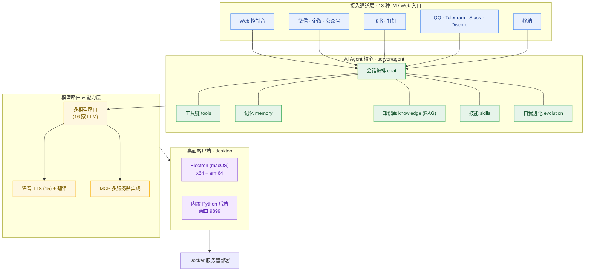

# Velthyn

**MoCode — AI Agent Server (Docker) + macOS Desktop Client**

多通道接入 · 多模型路由 · Agent 核心 · MCP 集成 · 记忆/知识/技能/自我进化

*Multi-channel · Multi-model · Agent Core · MCP Integration · Memory / Knowledge / Skills / Self-Evolution*

---

## 项目定位 · Positioning

**Velthyn** 是一套「服务器 + 桌面」一体化部署的 **AI Agent 平台**：

- **server/** —— 基于 **Mocode** 语言编写的多通道 AI Agent 服务端核心，以 **Docker** 部署；
- **desktop/** —— 基于 **Electron** 的 macOS 桌面客户端（内置 Python 后端，端口 9899）。

它解决的核心问题是：**如何用一个 Agent 大脑，接入所有主流 IM 与 Web 入口，并具备记忆、知识、技能与自我进化的能力。**

> **定位一句话**：*One Agent core, everywhere you chat.*

---

## 整体架构 · Architecture Overview

整个系统自下而上分为 **接入 → Agent 核心 → 模型能力 → 桌面客户端** 四层，数据单向流转，各层职责清晰：



> 完整架构图参见 [docs/architecture.png](docs/architecture.png)。

**架构设计原则**：
- **多通道统一会话**：13 种 IM/Web 入口共享同一 Agent 大脑与记忆；
- **多模型热切换**：16 家模型后端并经 Web 控制台一键切换，故障转移有保障；
- **Agent 工具链**：规划 → 工具调用 → 记忆回写，闭环执行复杂任务；
- **可扩展**：插件系统（plugins/）+ 技能系统（skills/）+ MCP 工具协议。

---

## 仓库结构 · Repository Layout

```
Velthyn/
├── server/                     # 服务器端 AI Agent 核心（Docker 部署）
│   ├── agent/                  # Agent 核心
│   │   ├── chat/               #   会话编排 / session
│   │   ├── tools/              #   工具链（bash/browser/read/write/edit/mcp...）
│   │   ├── memory/             #   记忆系统（短期 + 长期）
│   │   ├── knowledge/          #   知识库（RAG 检索）
│   │   ├── skills/             #   技能系统（SKILL.md 规范）
│   │   ├── evolution/          #   自我进化（self-learning / backup / trigger）
│   │   ├── prompt/             #   提示词管理
│   │   └── workspace/          #   工作区 / 沙箱
│   ├── channel/                # 多平台接入（13 种）
│   ├── models/                 # 多模型接入（16 家）
│   ├── bridge/                 # Agent ↔ 通道桥接层
│   ├── plugins/                # 插件系统（banwords/godcmd/role/tool/keyword...）
│   ├── skills/                 # 全局技能库（image-generation/knowledge-wiki/skill-creator）
│   ├── voice/                  # 语音合成（15 家）
│   ├── translate/              # 翻译（百度 / 有道）
│   ├── cli/                    # 命令行入口（cow）
│   ├── common/                 # 公共工具（log/const/ssl_certs）
│   ├── config-template.json    # 配置模板
│   ├── app.mo                  # 服务端主入口
│   └── Dockerfile              # Docker 构建
└── desktop/                    # macOS Electron 桌面客户端
    ├── main.js                 # Electron 主进程
    ├── preload.js              # 预加载脚本
    ├── scripts/                # 构建脚本（build_mac / setup_runtime / gen_icon）
    └── package.json            # 依赖与构建命令
```

---

## server/ — 服务器端 AI Agent 核心

Docker 部署的多通道 AI 智能体核心，能力全景如下。

### 多通道接入 · Multi-channel Access（13 种）

| 通道 | 目录 | 说明 |
|------|------|------|
| Web 控制台 | `channel/web` | 浏览器对话与模型切换 |
| 微信 | `channel/weixin, wechat_kf` | 个人号 / 客服号 |
| 企业微信 / 公众号 | `channel/wechatcom, wechatmp, wecom_bot` | 企微 / 公众号 / 企微机器人 |
| 飞书 | `channel/feishu` | 飞书机器人 |
| 钉钉 | `channel/dingtalk` | 钉钉机器人 |
| QQ / 企点 | `channel/qq` | QQ 与企点 |
| Telegram | `channel/telegram` | Telegram Bot |
| Slack | `channel/slack` | Slack App |
| Discord | `channel/discord` | Discord Bot |
| 终端 | `channel/terminal` | 本地终端对话 |

### 多模型接入 · Multi-model Routing（16 家）

`Claude · GPT/OpenAI · Gemini · DeepSeek · Qwen(通义) · Kimi(Moonshot) · 豆包(Doubao) · GLM(ZhipuAI) · MiniMax · 文心(Qianfan) · 百度 · 讯飞(Xunfei) · DashScope · ModelScope · LinkAI · Mimo`，经 `models/bot_factory.mo` 统一工厂创建，Web 控制台一键切换。

### Agent 能力 · Agent Capabilities

- **任务规划**：理解意图，拆解步骤，按序执行；
- **工具调用**：`bash` / `browser` / `read` / `write` / `edit` / `search` 等，见 `agent/tools/`；
- **长期记忆**：`agent/memory/`，短期会话 + 长期持久化；
- **知识库**：`agent/knowledge/`，RAG 检索增强生成；
- **技能系统**：`agent/skills/`，遵循 `SKILL.md` 规范，动态加载；
- **自我进化**：`agent/evolution/`，基于自我学习（self-evolution）沉淀记忆与技能。

### MCP 集成 · MCP Integration

支持 **MCP 多服务器系统**（`agent/tools/mcp/mcp_client.mo`、`mcp_oauth.mo`、`mcp_tool.mo`），可将外部工具服务器（文件系统、数据库、API、外部服务）统一接入 Agent 工具链。

### 插件系统 · Plugin System

`server/plugins/` 提供可热插拔插件：`banwords`（违禁词）、`godcmd`（命令）、`role`（角色扮演）、`tool`（工具）、`keyword`（关键词）、`hello`（欢迎）、`dungeon`（跑团）等，配合 `event.mo` 事件机制。

### 快速启动（server）

```bash
cd server
docker build -t velthyn-server .
# 或直接使用基础镜像运行
cp config-template.json config.json   # 修改模型/通道配置
./run.sh
```

### Docker 镜像 · Docker Images

本项目的相关镜像已发布到公开 Registry **`dl.gzwebsj.cn`**（HTTPS，无需 `docker login`），可直接 `docker pull` 拉取：

| 镜像 | 地址 | 说明 |
|------|------|------|
| mocode-web | `dl.gzwebsj.cn/gzwebsj-local/mocode-web:latest` | Web 控制台 / Agent 服务端 |
| mocode-admin | `dl.gzwebsj.cn/gzwebsj-local/mocode-admin:latest` | 管理面板 |
| mocode-cli | `dl.gzwebsj.cn/gzwebsj-local/mocode-cli:latest` | 命令行工具 |
| mocode-awf | `dl.gzwebsj.cn/gzwebsj-local/mocode-awf:latest` | Agent 工作流 |
| mocode-prompt-repo | `dl.gzwebsj.cn/gzwebsj-local/mocode-prompt-repo:latest` | 提示词仓库 |
| webbridge-browser | `dl.gzwebsj.cn/gzwebsj-local/webbridge-browser:latest` | 浏览器桥 |
| redis | `dl.gzwebsj.cn/gzwebsj-local/redis:7-alpine` | 缓存 |
| mariadb | `dl.gzwebsj.cn/gzwebsj-local/mariadb:10.11` | 数据库 |

**拉取示例**：

```bash
docker pull dl.gzwebsj.cn/gzwebsj-local/mocode-web:latest
docker pull dl.gzwebsj.cn/gzwebsj-local/mocode-admin:latest
```

> Registry 主页：`https://dl.gzwebsj.cn`（公开，直接访问 `/v2/_catalog` 可查看全部镜像列表）。

---

## desktop/ — macOS 桌面客户端

基于 **Electron 28+** 的 macOS 桌面应用，支持 **Intel x64** 与 **Apple Silicon arm64**。

- 启动内置 **Python 后端**（端口 9899）；
- 加载 **Web 前端**聊天界面；
- **系统托盘**常驻运行；
- 内置 MCP 多服务器管理与智能体管理。

### 启动（desktop）

```bash
cd desktop
npm install
npm start
```

### 构建

```bash
npm run build:mac          # 构建 macOS dmg
npm run build:all          # 构建所有平台
npm run build:mac:dir      # 构建非打包目录（便于查错）
```

---

## 技术与论文衬托 · Academic Foundations

本项目的多项设计可在学术界找到思想源头，以下为概念映射（供技术背景衬托，非直接引用代码）：

| 技术点 | 设计思想 | 参考论文 / 规范 |
|--------|---------|----------------|
| **多通道统一接入** | 统一消息抽象 + 通道适配器模式，相似于多平台 Bot 框架 | Gamma et al., *Design Patterns* (1994) 的 Adapter / Facade 模式 |
| **多模型路由 / 工厂** | 基于工厂模式动态创建模型后端，实现可插拔多模型 | Gamma et al., *Design Patterns* (1994)；OpenAI *Function Calling* 技术报告 |
| **Agent 规划-执行** | 推理 + 行动交错，让 LLM 边思考边调用工具 | Yao et al., *ReAct: Synergizing Reasoning and Acting in Language Models* (ICLR 2023) |
| **工具调用 / 工具使用** | LLM 学会调用外部工具，弥补知识不足 | Schick et al., *Toolformer: Language Models Can Teach Themselves to Use Tools* (2023) |
| **长期记忆** | 记忆分层（短期 / 长期），检索相关历史促进多轮一致性 | Park et al., *Generative Agents: Interactive Simulacra of Human Behavior* (UIST 2023) |
| **知识库 RAG** | 检索增强生成，外挂知识库提升事实准确性 | Lewis et al., *Retrieval-Augmented Generation for Knowledge-Intensive NLP Tasks* (NeurIPS 2020) |
| **Skills 技能系统** | 以文档化规范（SKILL.md）封装可复用能力 | 组件化 / 模块化软件工程；AlphaCodium（Ridnik et al., 2024）的工作流结构化思想 |
| **自我进化 / self-learning** | Agent 在交互中沉淀经验、反哺自身能力 | Shinn et al., *Reflexion: Language Agents with Verbal Reinforcement Learning* (NeurIPS 2023)；Voyager（Wang et al., 2023）终身学习 |
| **MCP 协议** | 统一的模型上下文工具协议，连接外部工具服务器 | Anthropic, *Model Context Protocol* (2024, 开源标准) |
| **语音合成 TTS** | 多引擎适配层，统一 TTS 封装 | 参见各家 TTS 引擎文档，用于语音回复场景 |
| **对话系统多轮维护** | Session 管理，保持上下文连贯 | Vinyals & Le, *A Neural Conversational Model* (2015)；对话状态跟踪 (DST) 领域 |

> **说明**：Velthyn 是工程化产品，上述论文/规范作为设计思想来源与背景参考；具体实现以源码为准。引用均为该领域公认的经典或里程碑工作，可在学术数据库检索验证。

---

## 安全说明 · Security Notes

- 所有 **API Key / 凭据** 通过 **环境变量** 或 **配置文件** 注入，勿硬编码进代码或提交至仓库；
- 仓库内**不含真实密钥**；部署时请使用 `config-template.json` 复制为 `config.json` 并填入自有凭据；
- Agent 工具（如 `bash`）具备工作区沙箱约束，避免越权访问。

---

## 贡献 · Contributing

欢迎提交 Issue 与 Pull Request。请阅读 `server/CONTRIBUTING.md` 了解开发约定。

---

## 许可证 · License

[MIT](LICENSE) © 2026 **gzwebsj-163**

---

*MoCode — One Agent Core, Everywhere You Chat · 一个大脑，全平台对话*
